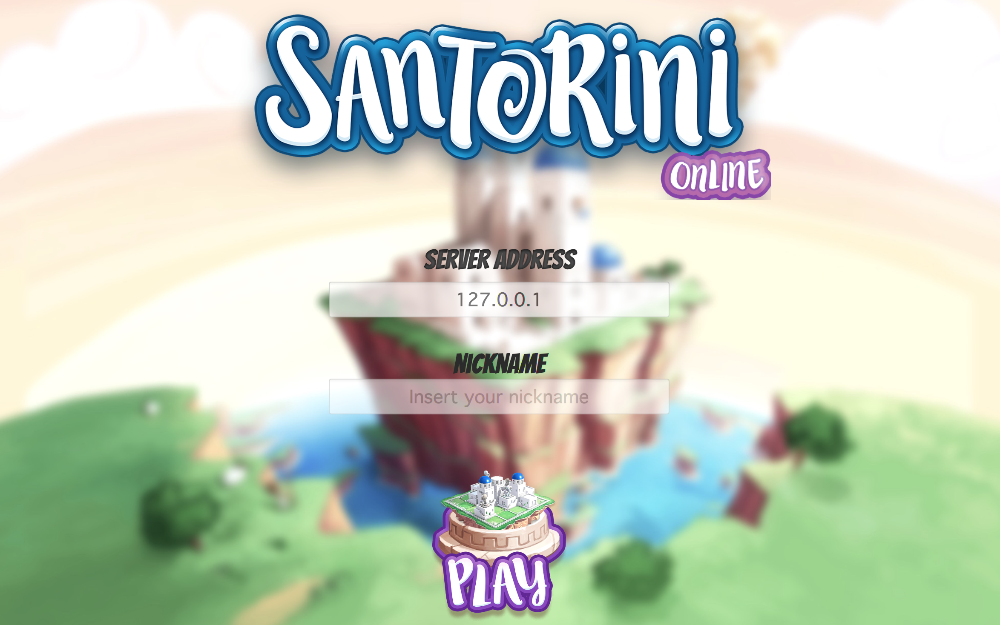

# Prova Finale Ingegneria del Software 2020
# Gioco Santorini (Cranio Creations)

## Gruppo PSP06

- ###   10583761   Hamza Haddaoui ([@hamzahaddaoui](https://github.com/hamzahaddaoui)) hamza.haddaoui@mail.polimi.it
- ###   10633778    Giusti Leonardo ([@giusti-leo](https://github.com/giusti-leo)) giusti.leonardo@mail.polimi.it
- ###   10607208    Dario Gervasio ([@Vasio1298](https://github.com/Vasio1298)) darioalex.gervasio@mail.polimi.it

| Functionality | State |
|:-----------------------|:------------------------------------:|
| Basic rules |  |
| Complete rules |  |
| Socket | |
| GUI |  |
| CLI |  |
| Multiple games |  |
| Persistence |  |
| Advanced Gods |  |
| Undo |  |

# File UML

Nella cartella deliveries/previous/uml è presente l'uml iniziale (del model).

In deliveries/final/uml  sono presenti gli UML finali creati, sia in versione dettagliata (uno per il package del Server, uno per il package Client) e una versione riassuntiva.

# JavaDoc e test

I Javadoc generati, così come i report dei test, si trovano nella cartella deliveries/final.

# Lancio file JAR

Per avviare il Server dell'applicazione è sufficiente fare doppio click su Server.jar, situato nella cartella deliveries/final/jar (oppure digitare da terminale, "java -jar Server.jar").

Per avviare il client dell'applicazione in versione GUI, è sufficiente fare doppio click su Client.jar, situato nella medesima cartella del Server (oppure digitare da terminale, "java -jar Client.jar").

Per avviare il client in versione CLI, è necessario da terminale digitare "java -jar Client.jar -cli"

<!--

-->
